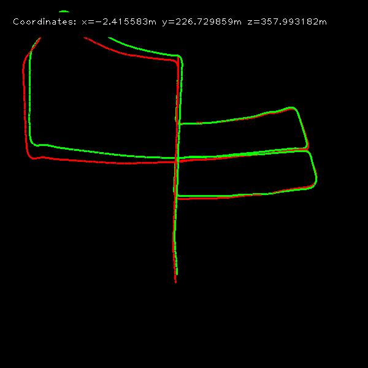

# Basic Monocular Visual Odometry with Python and KITTI Dataset

Using pykitti, learned how to handle kitti dataset easily and implement basic visual-odometry.

**Keywords:** FAST Feature Detection, LK Feature Tracking, Five-Point Motion Estimation, KITTI Dataset, pykitti

> forked from https://github.com/uoip/monoVO-python


<p align="center">
    
</p>

### Requirements
* Python 2.7
* Numpy
* OpenCV
* pykitti

### Dataset
* [KITTI odometry data set (grayscale, 22 GB)](http://www.cvlibs.net/datasets/kitti/eval_odometry.php)

* [KITTI raw data set](http://www.cvlibs.net/datasets/kitti/raw_data.php)

### Usage

This repo supports two type of dataset (odometry/raw)

For each code, Change dataset path to your dataset directory. 

- odom_dataset_vo.py
```
kitti_odom_dir = "/home/swimming/Documents/Dataset/dataset"
kitti_odom_sequence = "05"
```

- raw_dataset_vo.py
```
kitti_root_dir = "/home/swimming/Documents/Dataset"
kitti_date = "2011_09_30"
kitti_drive = "0033"
```

* then, execute your prefer method.
```
python odom_dataset_vo.py
# or
python raw_dataset_vo.py
```

---
### References
1. [一个简单的视觉里程计实现 | 冯兵的博客](http://fengbing.net/2015/07/26/%E4%B8%80%E4%B8%AA%E7%AE%80%E5%8D%95%E7%9A%84%E8%A7%86%E8%A7%89%E9%87%8C%E7%A8%8B%E8%AE%A1%E5%AE%9E%E7%8E%B01/ )<br>
2. [Monocular Visual Odometry using OpenCV](http://avisingh599.github.io/vision/monocular-vo/) and its related project report [_Monocular Visual Odometry_](http://avisingh599.github.io/assets/ugp2-report.pdf) | Avi Singh
 
Search "cv2.findEssentialMat", "cv2.recoverPose" etc. in github, you'll find more python projects on slam / visual odometry / 3d reconstruction
